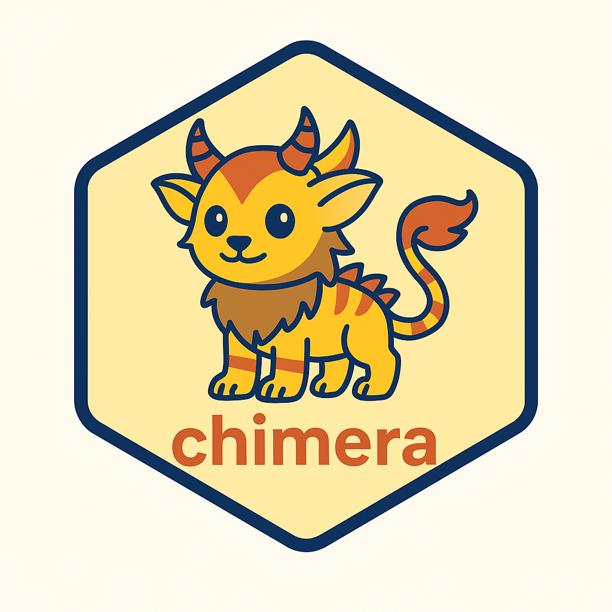

# MVN: An R Package for Assessing Multivariate Normality

---

**chimera** is an R package for multimodal biomedical learning. It integrates diverse data types—omics, clinical, text, and imaging—through unified preprocessing, flexible fusion strategies (early, late, hybrid), machine learning, and explainability.

The name comes from the mythical **Chimera**, a fusion of lion, goat, and serpent—symbolizing integration of heterogeneous modalities into one powerful model.

✨ **Features**

- **Unified multimodal pipeline**  
  Manage multiple assays with MultiAssayExperiment or lists.

- **Modality encoders**  
  - Numeric / omics (scaling, PCA).  
  - Text (TF–IDF via text2vec).  
  - Imaging (intensity statistics; CNN stubs with torch/keras).  
  - Custom encoders pluggable.

- **Fusion strategies**  
  - Early fusion (concatenate features).  
  - Late fusion (per-modality learners stacked by meta-model).  
  - Hybrid fusion (combine both).

- **Machine learning**  
  Compatible with parsnip, workflows, recipes.

- **Explainability**  
  Model interpretation via DALEX (feature importance, SHAP-like).

---

🔧 **Installation**

```r
# Install devtools if needed
install.packages("devtools")

# Install chimera from GitHub
devtools::install_github("yourname/chimera")
```

---

🚀 **Example**

```r
library(chimera)
library(parsnip)
library(MultiAssayExperiment)

set.seed(1)
n <- 200
id <- sprintf("S%03d", 1:n)
y <- factor(rbinom(n, 1, 0.5), labels = c("neg","pos"))

# Numeric modality (omics-like)
X1 <- matrix(rnorm(n*50), n, 50, dimnames = list(id, paste0("g",1:50)))

# Text modality
txt <- ifelse(y=="pos", "inflammation fibrosis signal", "homeostasis baseline normal")
text_df <- data.frame(text = txt, row.names = id)

mae <- MultiAssayExperiment(
  experiments = ExperimentList(list(
    omics = SummarizedExperiment::SummarizedExperiment(assays=list(counts=X1)),
    notes = SummarizedExperiment::SummarizedExperiment(assays=list(table=text_df))
  )),
  colData = DataFrame(data.frame(class = y, row.names = id))
)

task <- chm_task(mae, outcome = as.data.frame(colData(mae)))
task <- chm_add_modality(task, "omics", encoder_numeric(n_components = 10))
task <- chm_add_modality(task, "notes", encoder_text_tfidf(text_col = "text"))
task <- chm_encode(task)
task <- chm_fuse(task, mode = "early")

learner <- logistic_reg(penalty = 0.01, mixture = 1) %>%
  set_engine("glmnet") %>%
  set_mode("classification")

task <- chm_fit(task, learner, outcome_name = "class", family = "classification")

expl <- chm_explain(task)
expl
```

---

📖 **Roadmap**

- Add CNN encoders for imaging (torch, keras).  
- Expand late-fusion stacking (full ensemble).  
- Visualization dashboards for multimodal explainability.  
- Benchmark datasets and vignettes.

---

🤝 **Contributing**

Contributions are welcome! Please submit issues or pull requests on GitHub.

---

📜 **License**

MIT License © 2025 Selçuk Korkmaz
